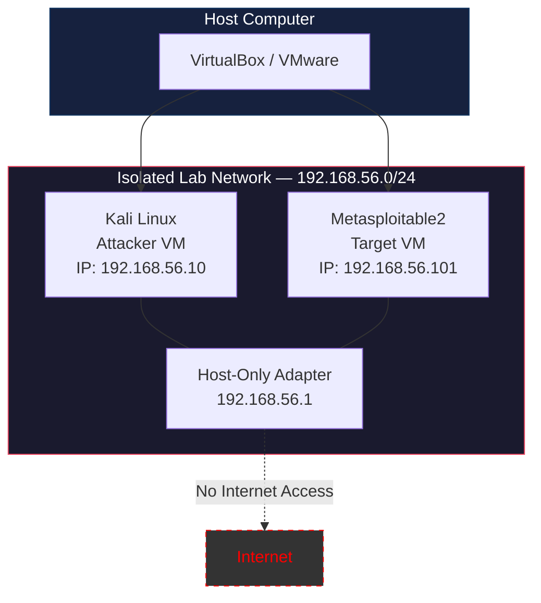

# Lab Network Architecture

> **ApexPlanet Cybersecurity Internship — Task 1**

---

## Architecture Diagram



---

## Network Details

| Component | IP Address | Subnet Mask | Role |
|-----------|-----------|-------------|------|
| Host Adapter | 192.168.56.1 | 255.255.255.0 | Gateway (local only) |
| Kali Linux | 192.168.56.10 | 255.255.255.0 | Attacker / Security testing |
| Metasploitable2 | 192.168.56.101 | 255.255.255.0 | Intentionally vulnerable target |

---

## Traffic Flow

```
Kali Linux (192.168.56.10)
        |
        | Host-Only Network
        |
Metasploitable2 (192.168.56.101)

✗ No traffic leaves the Host-Only network
✗ No internet access from either VM
✓ All communication is isolated and local
```

---

## Key Principles

1. **Isolation:** The Host-Only network has no route to external networks
2. **Authorization:** All targets are intentionally vulnerable VMs owned by the user
3. **Safety:** No production systems or public infrastructure is involved
4. **Reversibility:** VM snapshots allow easy restoration to a clean state
