# OSI Model Reference

> **ApexPlanet Cybersecurity Internship — Task 1**

---

## Diagram

```mermaid
graph LR
    subgraph L7["Layer 7: Application"]
        A7[HTTP, FTP, DNS, SSH, SMTP]
    end
    subgraph L6["Layer 6: Presentation"]
        A6[SSL/TLS, JPEG, ASCII, Encryption]
    end
    subgraph L5["Layer 5: Session"]
        A5[NetBIOS, RPC, Session Management]
    end
    subgraph L4["Layer 4: Transport"]
        A4[TCP, UDP, Port Numbers]
    end
    subgraph L3["Layer 3: Network"]
        A3[IP, ICMP, Routers]
    end
    subgraph L2["Layer 2: Data Link"]
        A2[Ethernet, MAC Addresses, Switches]
    end
    subgraph L1["Layer 1: Physical"]
        A1[Cables, Hubs, Wireless Signals]
    end

    L7 --> L6 --> L5 --> L4 --> L3 --> L2 --> L1

    style L7 fill:#e74c3c,color:#fff
    style L6 fill:#e67e22,color:#fff
    style L5 fill:#f1c40f,color:#000
    style L4 fill:#2ecc71,color:#fff
    style L3 fill:#3498db,color:#fff
    style L2 fill:#9b59b6,color:#fff
    style L1 fill:#34495e,color:#fff
```

---

## Detailed Reference

| Layer | Name | PDU | Function | Devices | Protocols | Mnemonic |
|-------|------|-----|----------|---------|-----------|----------|
| 7 | Application | Data | User-facing services | — | HTTP, FTP, DNS, SMTP, SSH | **A**ll |
| 6 | Presentation | Data | Format, encryption, compression | — | SSL/TLS, JPEG, ASCII | **P**eople |
| 5 | Session | Data | Session management | — | NetBIOS, RPC | **S**eem |
| 4 | Transport | Segment | End-to-end delivery | — | TCP, UDP | **T**o |
| 3 | Network | Packet | Logical addressing, routing | Routers | IP, ICMP | **N**eed |
| 2 | Data Link | Frame | Physical addressing | Switches | Ethernet, ARP | **D**ata |
| 1 | Physical | Bits | Raw bit transmission | Hubs, Cables | — | **P**rocessing |

---

## Security Relevance by Layer

| Layer | Common Attacks | Defensive Measures |
|-------|---------------|-------------------|
| 7 | SQL injection, XSS, phishing | Input validation, WAF, user training |
| 6 | SSL stripping, downgrade attacks | Enforce TLS 1.3, HSTS |
| 5 | Session hijacking | Secure session tokens, timeout policies |
| 4 | SYN flood, port scanning | Firewalls, rate limiting |
| 3 | IP spoofing, routing attacks | Anti-spoofing rules, IPSec |
| 2 | MAC flooding, ARP spoofing | Port security, static ARP |
| 1 | Cable tapping, jamming | Physical security, shielding |
