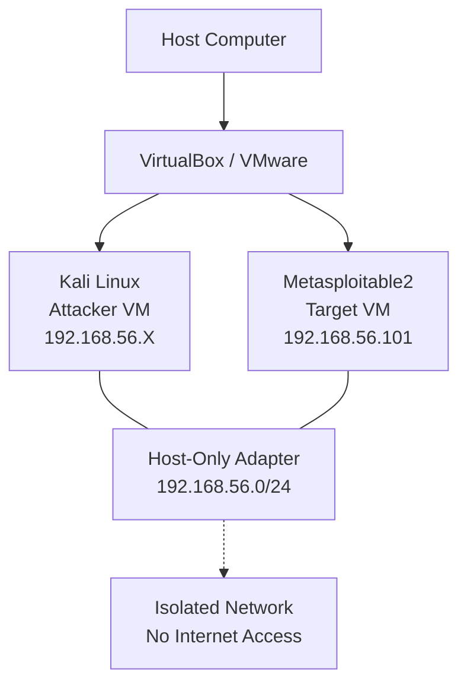

# 02 — Lab Environment Setup

> **ApexPlanet Cybersecurity Internship — Task 1, Day 2–3**
> Setting up an isolated virtual lab for authorized cybersecurity learning activities.

---

## Lab Architecture



**Key Principle:** Both VMs communicate through an isolated Host-Only network. Neither VM has internet access during lab exercises.

---

## Components

| Component | Details |
|-----------|---------|
| **Virtualization Platform** | VirtualBox 7.x (or VMware Workstation Player) |
| **Attacker VM** | Kali Linux (latest rolling release) |
| **Target VM** | Metasploitable2 (Ubuntu-based, intentionally vulnerable) |
| **Network** | Host-Only Adapter — 192.168.56.0/24 |
| **Host OS** | [Your Host OS — e.g., Windows 11, macOS, Linux] |

---

## Installation Checklist

### Step 1: Install Virtualization Software

- [ ] Download VirtualBox from [virtualbox.org](https://www.virtualbox.org/)
- [ ] Install VirtualBox on the host machine
- [ ] Verify VirtualBox launches correctly

### Step 2: Install Kali Linux

- [ ] Download Kali Linux VM image from [kali.org](https://www.kali.org/get-kali/)
- [ ] Choose the "VirtualBox" or "VMware" pre-built image
- [ ] Import/open the VM in VirtualBox
- [ ] Allocate resources: 4 GB RAM, 2 CPU cores, 40 GB disk
- [ ] Boot Kali Linux and verify login (default: `kali`/`kali`)
- [ ] Take a snapshot for easy restoration

> [ADD REAL SCREENSHOT HERE: Kali Linux VM settings in VirtualBox]

### Step 3: Install Metasploitable2

- [ ] Download Metasploitable2 from [sourceforge.net](https://sourceforge.net/projects/metasploitable/)
- [ ] Extract the downloaded archive
- [ ] Import/open the VM in VirtualBox
- [ ] Allocate resources: 1 GB RAM, 1 CPU core, 20 GB disk
- [ ] Boot Metasploitable2 and verify login (default: `msfadmin`/`msfadmin`)
- [ ] Take a snapshot

> [ADD REAL SCREENSHOT HERE: Metasploitable2 VM settings in VirtualBox]

### Step 4: Configure Host-Only Network

- [ ] Open VirtualBox → File → Host Network Manager
- [ ] Create a Host-Only network (e.g., `VirtualBox Host-Only Ethernet Adapter`)
- [ ] Set the IPv4 address: `192.168.56.1` / Subnet: `255.255.255.0`
- [ ] Disable the DHCP server (we will use static IPs)
- [ ] Attach both VMs' network adapters to this Host-Only network

> [ADD REAL SCREENSHOT HERE: VirtualBox Host-Only network settings]

### Step 5: Configure VM Network Adapters

**Kali Linux:**
- [ ] Open VM Settings → Network
- [ ] Adapter 1: Host-Only Adapter
- [ ] Ensure it is connected to the correct Host-Only network

**Metasploitable2:**
- [ ] Open VM Settings → Network
- [ ] Adapter 1: Host-Only Adapter
- [ ] Ensure it is connected to the same Host-Only network

### Step 6: Configure IP Addresses

**Kali Linux (static IP):**
```bash
# Edit network configuration
sudo nano /etc/network/interfaces

# Add or modify:
auto eth0
iface eth0 inet static
    address 192.168.56.10
    netmask 255.255.255.0
    gateway 192.168.56.1

# Restart networking
sudo systemctl restart networking
```

**Metasploitable2 (static IP):**
```bash
# Edit network configuration
sudo nano /etc/network/interfaces

# Add or modify:
auto eth0
iface eth0 inet static
    address 192.168.56.101
    netmask 255.255.255.0
    gateway 192.168.56.1

# Restart networking
sudo /etc/init.d/networking restart
```

> [ADD REAL SCREENSHOT HERE: Kali Linux IP configuration]

> [ADD REAL SCREENSHOT HERE: Metasploitable2 IP configuration]

### Step 7: Verify Connectivity

```bash
# From Kali Linux
ping -c 4 192.168.56.101

# From Metasploitable2
ping -c 4 192.168.56.10
```

> [ADD REAL SCREENSHOT HERE: Successful ping test]

### Step 8: Verify Isolation

```bash
# From Kali Linux — should fail (no internet access)
ping -c 2 8.8.8.8
# Expected: Network is unreachable or request timed out
```

---

## Troubleshooting

| Issue | Solution |
|-------|----------|
| VMs cannot ping each other | Verify both VMs use the same Host-Only network adapter |
| No IP address assigned | Check `/etc/network/interfaces` and restart networking |
| Internet accessible from lab | Remove any NAT adapters; ensure Host-Only only |
| Metasploitable2 not booting | Increase RAM to at least 1 GB |
| Host-Only adapter not showing | Reinstall VirtualBox and enable the Host-Only feature |
| Kali has no network | Check adapter is attached to Host-Only, not "Not attached" |

---

## Security Precautions

1. **Never** connect Metasploitable2 to a public or production network
2. **Always** use Host-Only or Internal networking for lab VMs
3. **Take snapshots** before and after lab exercises for easy restoration
4. **Disable** shared folders and clipboard sharing during security exercises
5. **Document** all IP addresses and configurations for reference

---

## Screenshot Checklist

| # | Screenshot | Status |
|---|------------|--------|
| 1 | Virtualization software installed | [ ] |
| 2 | Kali Linux VM running | [ ] |
| 3 | Metasploitable2 VM running | [ ] |
| 4 | Host-Only network adapter settings | [ ] |
| 5 | Kali Linux IP configuration (`ip addr`) | [ ] |
| 6 | Metasploitable2 IP configuration (`ifconfig`) | [ ] |
| 7 | Ping test: Kali → Metasploitable2 | [ ] |
| 8 | Ping test: Metasploitable2 → Kali | [ ] |
| 9 | Internet isolation test (ping fails) | [ ] |
| 10 | Wireshark capture on Host-Only interface | [ ] |

---

**Next:** [03 — Linux Fundamentals](03-linux-fundamentals.md)
