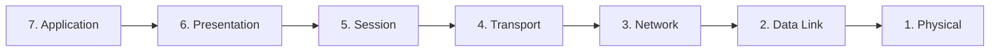

# 04 — Networking Basics

> **ApexPlanet Cybersecurity Internship — Task 1, Day 4–5**
> Understanding networking is fundamental to cybersecurity.

---

## OSI Model

The Open Systems Interconnection model describes network communication in seven layers.



| Layer | Name | Function | Protocols/Devices |
|-------|------|----------|-------------------|
| 7 | Application | User-facing network services | HTTP, FTP, DNS, SMTP, SSH |
| 6 | Presentation | Data formatting, encryption, compression | SSL/TLS, JPEG, ASCII |
| 5 | Session | Manages sessions between applications | NetBIOS, RPC |
| 4 | Transport | End-to-end communication, reliability | TCP, UDP |
| 3 | Network | Logical addressing and routing | IP, ICMP, Routers |
| 2 | Data Link | Physical addressing (MAC), frames | Ethernet, Switches |
| 1 | Physical | Raw bit transmission | Cables, Hubs, Wireless |

**Mnemonic (top to bottom):** "All People Seem To Need Data Processing"

---

## TCP/IP Model

The practical model used on the internet with four layers:

| TCP/IP Layer | OSI Layers | Description |
|-------------|------------|-------------|
| Application | 5, 6, 7 | HTTP, DNS, FTP, SMTP, SSH |
| Transport | 4 | TCP, UDP |
| Internet | 3 | IP, ICMP, routing |
| Network Access | 1, 2 | Ethernet, Wi-Fi, physical |

---

## TCP vs UDP

### TCP (Transmission Control Protocol)

- **Connection-oriented:** Three-way handshake (SYN → SYN-ACK → ACK)
- **Reliable:** Guarantees delivery, ordering, error checking
- **Slower:** Overhead from connection management
- **Use cases:** Web browsing (HTTP), email (SMTP), file transfer (FTP), SSH

### UDP (User Datagram Protocol)

- **Connectionless:** No handshake; data sent immediately
- **Unreliable:** No guarantee of delivery or ordering
- **Faster:** Minimal overhead
- **Use cases:** DNS queries, video streaming, VoIP, online gaming

| Feature | TCP | UDP |
|---------|-----|-----|
| Connection | Oriented | Connectionless |
| Reliability | Guaranteed | Best-effort |
| Speed | Slower | Faster |
| Header Size | 20 bytes | 8 bytes |
| Flow Control | Yes | No |
| Examples | HTTP, SSH, FTP | DNS, DHCP, VoIP |

---

## DNS (Domain Name System)

DNS translates domain names into IP addresses.

### Resolution Process

1. User types `www.example.com`
2. Browser checks local cache
3. Query sent to recursive resolver (ISP DNS)
4. Resolver queries root servers → TLD servers → authoritative servers
5. IP address returned and cached

### DNS Record Types

| Record | Purpose | Example |
|--------|---------|---------|
| A | Domain → IPv4 address | example.com → 93.184.216.34 |
| AAAA | Domain → IPv6 address | example.com → 2606:2800:220:1:... |
| CNAME | Alias to another domain | www.example.com → example.com |
| MX | Mail server | example.com → mail.example.com |
| TXT | Text data (SPF, DKIM) | SPF/DKIM verification |
| NS | Name server | example.com → ns1.example.com |

### DNS Security Concerns

- **DNS spoofing/poisoning:** Redirecting users to malicious sites
- **DNS over HTTPS (DoH):** Encrypts DNS queries
- **DNSSEC:** Adds cryptographic verification to DNS responses

---

## HTTP vs HTTPS

| Feature | HTTP | HTTPS |
|---------|------|-------|
| Port | 80 | 443 |
| Encryption | None (plaintext) | SSL/TLS encryption |
| Security | Vulnerable to eavesdropping | Confidential and tamper-resistant |
| Certificate | None required | Digital certificate required |
| URL prefix | `http://` | `https://` |

---

## IP Addressing

### IPv4

- 32-bit address: `192.168.1.100`
- Approximately 4.3 billion addresses

### Private IP Ranges (RFC 1918)

| Range | CIDR | Usable Hosts |
|-------|------|-------------|
| 10.0.0.0 – 10.255.255.255 | 10.0.0.0/8 | ~16.7 million |
| 172.16.0.0 – 172.31.255.255 | 172.16.0.0/12 | ~1 million |
| 192.168.0.0 – 192.168.255.255 | 192.168.0.0/16 | ~65,000 |

### IPv6

- 128-bit address: `2001:0db8:85a3:0000:0000:8a2e:0370:7334`
- Virtually unlimited addresses

---

## Subnetting Basics

Subnetting divides a network into smaller sub-networks.

**Formula:** Usable hosts = 2^n - 2 (where n = host bits)

| CIDR | Subnet Mask | Usable Hosts |
|------|-------------|-------------|
| /24 | 255.255.255.0 | 254 |
| /25 | 255.255.255.128 | 126 |
| /26 | 255.255.255.192 | 62 |
| /27 | 255.255.255.224 | 30 |
| /28 | 255.255.255.240 | 14 |

---

## NAT (Network Address Translation)

Translates private IP addresses to public IP addresses.

| Type | Description |
|------|-------------|
| Static NAT | One-to-one mapping |
| Dynamic NAT | Maps to pool of public IPs |
| PAT | Multiple private IPs share one public IP via ports |

---

## TCP Three-Way Handshake

```
Client                    Server
  |------ SYN ------------>|     Step 1: Client initiates
  |<----- SYN+ACK ---------|     Step 2: Server responds
  |------ ACK ------------>|     Step 3: Client confirms
  |     Connection Established |
```

---

**See also:** [Networking Command Cheat Sheet](../cheat-sheets/networking-command-cheat-sheet.md)

**Next:** [05 — Cryptography Basics](05-cryptography-basics.md)
